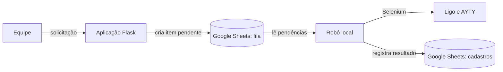

# Automação de onboarding/offboarding

Aplicação para gerenciar o onboarding e o desligamento de operadores nos portais CRM Ligo e AYTY. A equipe registra as solicitações em um formulário web; um robô local processa a fila nos portais e atualiza os registros no Google Sheets.

## Como funciona

O site e o robô foram separados para que o formulário possa ser hospedado sem expor as credenciais dos portais. A comunicação entre eles acontece pelas planilhas:



Cada solicitação pode ser de cadastro ou distrato. Para um novo cadastro, o robô cria o usuário e registra uma matrícula sequencial. Se o CPF já estiver presente no portal, o fluxo é tratado como retorno e o usuário é reativado. No distrato, o usuário é desativado; no AYTY, o superior também é atualizado conforme a configuração do projeto.

O login é derivado dos quatro primeiros dígitos do CPF e recebe mais um dígito a cada colisão, até ficar disponível no portal.

## Estrutura do projeto

```text
automacao_cadastros/
├── src/
│   ├── app.py          # aplicação Flask e formulário
│   ├── robo.py         # processamento da fila
│   ├── config.py       # leitura das configurações
│   ├── planilhas.py    # integração com Google Sheets
│   ├── portais.py      # automação com Selenium
│   ├── modelos.py      # modelos de domínio
│   ├── utils.py        # validações e funções auxiliares
│   ├── templates/
│   └── static/
├── deploy/              # Dockerfiles e orientações para Railway
├── .env.example
└── requirements.txt
```

## Requisitos

- Python 3.12 ou superior
- Google Chrome, para executar o robô localmente
- Uma conta de serviço do Google com acesso às planilhas

## Configuração

Crie uma conta de serviço no Google Cloud, habilite as APIs Google Sheets e Google Drive e baixe a chave JSON. Salve o arquivo como `credentials_google.json` na raiz do projeto e compartilhe as duas planilhas com o e-mail dessa conta, com permissão de editor.

Em seguida, copie `.env.example` para `.env` e preencha os identificadores das planilhas, as credenciais dos portais e, se desejar receber avisos, os dados de SMTP.

```ini
FLASK_SECRET_KEY=<chave-secreta>
GOOGLE_CREDENTIALS_FILE=credentials_google.json

SHEET_CREDENCIAIS_ID=<id-da-planilha-de-configuracao>
SHEET_REGISTROS_ID=<id-da-planilha-de-registros>

LIGO_USER=<usuario-ligo>
LIGO_PASSWORD=<senha-ligo>
AYTY_USER=<usuario-ayty>
AYTY_PASSWORD=<senha-ayty>
```

O ID de uma planilha é o trecho da URL entre `/d/` e `/edit`. Os nomes das abas, as configurações de SMTP e demais opções estão documentados em `.env.example`.

## Planilhas

São usadas duas planilhas.

| Planilha | Abas | Finalidade |
|---|---|---|
| Configuração | `senha`, `mapa_projeto`, `emails` | Controla o acesso ao formulário, o mapeamento dos projetos e os destinatários das notificações. |
| Registros | `cadastros`, `fila` | Mantém os usuários processados e as solicitações pendentes. |

Na aba `mapa_projeto`, cada projeto precisa informar os nomes correspondentes no Ligo e no AYTY, além dos supervisores de cada portal. A primeira coluna, `Projeto`, é a lista exibida no formulário.

Na aba `fila`, cada portal possui seu próprio status. Assim, uma solicitação concluída no Ligo continua disponível para processamento no AYTY, e o inverso também é verdadeiro.

## Instalação e uso

Instale as dependências:

```bash
pip install -r requirements.txt
```

Inicie o formulário:

```bash
python src/app.py
```

O endereço local é `http://localhost:5000`. A senha é validada a partir da aba `senha` da planilha de configuração.

Para processar a fila:

```bash
python src/robo.py --portal ligo
python src/robo.py --portal ayty
python src/robo.py --portal ambos
```

Use `--dry-run` para conferir o que seria processado sem abrir o navegador nem alterar as planilhas:

```bash
python src/robo.py --portal ambos --dry-run
```

## Implantação

O projeto pode ser publicado no Railway como dois serviços do mesmo repositório:

| Serviço | Dockerfile | Responsabilidade |
|---|---|---|
| Site | `deploy/site.Dockerfile` | Disponibiliza o formulário Flask. |
| Robô | `deploy/robo.Dockerfile` | Processa a fila em uma tarefa agendada. |

Mantenha as credenciais `LIGO_*` e `AYTY_*` somente no serviço do robô. O guia de implantação está em [deploy/README.md](deploy/README.md).

## Segurança

Os arquivos `.env` e `credentials_google.json` não devem ser versionados. As credenciais dos portais permanecem no servidor ou no ambiente do robô e não são enviadas ao navegador. Em produção, mantenha `FLASK_DEBUG` desativado.
